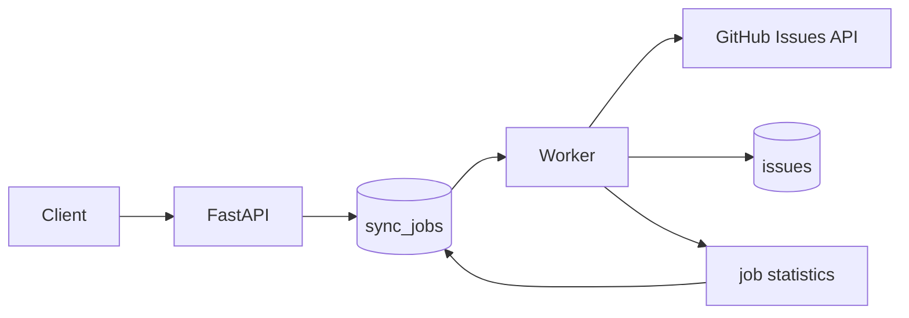

# github-data-sync-service

[](https://github.com/lukaszj321/github-data-sync-service/actions/workflows/ci.yml)

Aktualna wersja rozwojowa: `0.2.0`

Najnowszy opublikowany release: `v0.1.0`

Release: <https://github.com/lukaszj321/github-data-sync-service/releases/tag/v0.1.0>

`github-data-sync-service` to backend do bezpiecznego rejestrowania publicznych repozytoriow GitHuba i synchronizacji ich danych operacyjnych do PostgreSQL. Milestone 2 dodaje kompletny vertical slice synchronizacji issues: klient API tworzy job, worker pobiera go z kolejki PostgreSQL, strona po stronie czyta GitHub Issues API, odrzuca pull requesty, idempotentnie zapisuje issues i aktualizuje statystyki joba.

## Wydania

Informacje o zmianach znajduja sie w [CHANGELOG.md](CHANGELOG.md). `v0.1.0` pozostaje ostatnim opublikowanym release'em do czasu osobnego wydania `v0.2.0`.

## Zakres Milestone 2

Gotowe sa:

- FastAPI, synchroniczne SQLAlchemy 2, PostgreSQL i Alembic.
- Rejestracja publicznych repozytoriow przez `GET /repos/{owner}/{repo}`.
- Kolejka `sync_jobs` oparta o `FOR UPDATE SKIP LOCKED`.
- Endpoint tworzenia synchronizacji issues.
- Worker wykonujacy joby `issues`.
- Paginacja GitHub Issues API przez naglowek `Link` i `rel="next"`.
- Filtrowanie pull requestow zwracanych przez endpoint issues.
- Idempotentny upsert issues bez duplikatow.
- Liczniki `fetched`, `skipped`, `created`, `updated`, `unchanged`, `error`.
- Rate-limit rescheduling przez `available_at`.
- Recovery starych jobow `running` po wygaslym heartbeat.

Nie ma jeszcze ETag, trwalych checkpointow stron, retry endpointu, cancellation, synchronizacji pull requestow jako osobnego zasobu, komentarzy, labeli, commitow, releases ani workflow runs.



## Architektura

API i worker uzywaja tego samego obrazu aplikacji, ale dzialaja jako osobne procesy. Endpoint `POST /repositories` wykonuje request do GitHuba przed zapisem repozytorium. Endpoint `POST /repositories/{repository_id}/sync` nie odpytuje GitHuba; tworzy lokalny job `pending` albo zwraca juz aktywny job dla tego repozytorium i zasobu.

Worker pobiera dostepne joby `pending` oraz `rate_limited` przez `FOR UPDATE SKIP LOCKED`, ustawia `running`, zwalnia transakcje i dopiero wtedy wykonuje request HTTP. Kazda strona GitHub API jest zapisywana w osobnej krotkiej transakcji: upsert issues, aktualizacja licznikow, `current_page`, request ID, rate limit remaining i heartbeat.

Worker izoluje nieoczekiwane bledy pojedynczego joba. Jezeli processor albo zapis strony rzuci blad spoza kontrolowanych bledow GitHuba, worker robi rollback aktywnej sesji, probuje oznaczyc job jako `failed` z bezpiecznym `last_error` w stylu `internal_error: RuntimeError`, czysci lock metadata i przechodzi do kolejnej iteracji. Jezeli baza jest chwilowo niedostepna i nie da sie oznaczyc joba jako `failed`, worker loguje blad, stosuje poll backoff i pozostaje uruchomiony.

Nie ma wznawiania od numeru strony. Ponowna proba joba zaczyna od pierwszej strony, bo numer strony GitHuba nie jest trwalym checkpointem.

## Struktura

```text
src/github_data_sync_service/
  api/
    routes/
      issues.py
      repositories.py
      sync_jobs.py
    schemas/
      issues.py
      repositories.py
      sync_jobs.py
  core/
  db/
    models/
      issue.py
      repository.py
      sync_job.py
  github/
    client.py
    models.py
    pagination.py
  issues/
  queue/
  repositories/
  worker/
    main.py
    processor.py
alembic/
tests/
```

## Konfiguracja

Konfiguracja pochodzi z `pydantic-settings` i zmiennych srodowiskowych:

```text
APP_ENV
LOG_LEVEL
DATABASE_URL
GITHUB_TOKEN
GITHUB_API_BASE_URL
GITHUB_API_VERSION
GITHUB_USER_AGENT
GITHUB_CONNECT_TIMEOUT_SECONDS
GITHUB_READ_TIMEOUT_SECONDS
GITHUB_MAX_ATTEMPTS
GITHUB_ISSUES_PER_PAGE
GITHUB_MAX_PAGES_PER_SYNC
WORKER_POLL_INTERVAL_SECONDS
WORKER_RATE_LIMIT_FALLBACK_SECONDS
WORKER_STALE_JOB_TIMEOUT_SECONDS
WORKER_ID
```

`GITHUB_ISSUES_PER_PAGE` jest ograniczone do `1..100`, domyslnie `100`. `GITHUB_MAX_PAGES_PER_SYNC` chroni worker przed nieskonczona petla paginacji. `GITHUB_TOKEN` jest opcjonalny i moze pochodzic wylacznie ze srodowiska; logi i wyjatki nie ujawniaja tokenu ani naglowka Authorization.

## Uruchomienie

Lokalne haslo w `compose.yaml` jest wylacznie demonstracyjne.

```powershell
docker compose up --build -d
curl http://localhost:8000/health
curl http://localhost:8000/ready
```

Reczny end-to-end smoke test synchronizacji issues:

```powershell
docker compose down --volumes --remove-orphans
docker compose up --build -d

$repo = Invoke-RestMethod -Method Post `
  -Uri http://localhost:8000/repositories `
  -ContentType "application/json" `
  -Body '{"owner":"lukaszj321","name":"github-data-sync-service"}'

$job = Invoke-RestMethod -Method Post `
  -Uri "http://localhost:8000/repositories/$($repo.id)/sync" `
  -ContentType "application/json" `
  -Body '{"resource_type":"issues"}'

for ($i = 0; $i -lt 60; $i++) {
  $current = Invoke-RestMethod -Uri "http://localhost:8000/sync-jobs/$($job.id)"
  if ($current.status -in @("completed", "failed", "rate_limited")) { break }
  Start-Sleep -Seconds 2
}

Invoke-RestMethod -Uri "http://localhost:8000/repositories/$($repo.id)/issues"
docker compose logs --no-color --tail 300 worker
docker compose exec worker github-data-sync-worker --version
docker compose exec worker id
docker compose down --volumes --remove-orphans
```

Migracje:

```powershell
alembic upgrade head
alembic downgrade -1
alembic upgrade head
```

## API

Endpointy:

```text
POST /repositories
GET /repositories?limit=50&offset=0
GET /repositories/{repository_id}
POST /repositories/{repository_id}/sync
GET /sync-jobs?limit=50&offset=0
GET /sync-jobs/{job_id}
GET /repositories/{repository_id}/issues?limit=50&offset=0
GET /health
GET /ready
```

Rejestracja repozytorium:

```powershell
curl -X POST http://localhost:8000/repositories `
  -H "Content-Type: application/json" `
  -d "{\"owner\":\"fastapi\",\"name\":\"fastapi\"}"
```

Utworzenie joba synchronizacji issues:

```powershell
curl -i -X POST http://localhost:8000/repositories/{repository_id}/sync `
  -H "Content-Type: application/json" `
  -d "{\"resource_type\":\"issues\"}"
```

Nowy job zwraca `202 Accepted`; jezeli istnieje aktywny job `pending`, `running` albo `rate_limited`, API zwraca go z `200 OK`. Odpowiedz zawiera naglowek:

```text
Location: /sync-jobs/{job_id}
```

Przyklad joba:

```json
{
  "id": "00000000-0000-0000-0000-000000000000",
  "repository_id": "00000000-0000-0000-0000-000000000000",
  "resource_type": "issues",
  "status": "pending",
  "attempt_count": 0,
  "current_page": 0,
  "fetched_count": 0,
  "skipped_count": 0,
  "created_count": 0,
  "updated_count": 0,
  "unchanged_count": 0,
  "error_count": 0,
  "last_error": null
}
```

Polling statusu:

```powershell
curl http://localhost:8000/sync-jobs/{job_id}
```

Listowanie lokalnych issues:

```powershell
curl "http://localhost:8000/repositories/{repository_id}/issues?state=open&limit=50&offset=0"
```

Endpoint issues czyta tylko PostgreSQL i nigdy nie wykonuje requestu do GitHuba. Brak lokalnych issues zwraca `200 OK` z pusta lista.

## Liczniki joba

- `fetched_count`: wszystkie elementy zwrocone przez GitHub Issues API, wlacznie z pull requestami.
- `skipped_count`: elementy pominiete, bo zawieraly pole `pull_request`.
- `created_count`: nowe lokalne issues.
- `updated_count`: istniejace issues, ktorych pola domenowe realnie sie zmienily.
- `unchanged_count`: istniejace issues identyczne z aktualna odpowiedzia GitHuba.
- `error_count`: przerwane proby lub bledy joba; pozostaje kumulatywny.

Dla poprawnie zakonczonej synchronizacji bez duplikatow po stronie GitHuba:

```text
created_count + updated_count + unchanged_count = fetched_count - skipped_count
```

## Paginacja i pull requesty

Pierwszy request do GitHuba uzywa:

```text
state=all
per_page=100
sort=created
direction=asc
```

Kolejne strony sa pobierane wylacznie z `rel="next"` w naglowku `Link`. Worker nie konstruuje recznie numerow stron. `next_url` musi uzywac `https`, wskazywac ten sam host i port co `GITHUB_API_BASE_URL` oraz nie moze zawierac danych uwierzytelniajacych. Powtorzony `next_url`, petla paginacji albo przekroczenie `GITHUB_MAX_PAGES_PER_SYNC` koncza job statusem `failed`.

GitHub Issues API moze zwracac pull requesty. Rekord jest pull requestem, jezeli zawiera klucz `pull_request`. Taki rekord zwieksza `fetched_count` i `skipped_count`, ale nie trafia do tabeli `issues` i nie jest bledem.

## Upsert i brak prune

Tabela `issues` ma unikalnosc `(repository_id, github_id)` oraz `(repository_id, number)`. Upsert uzywa PostgreSQL `ON CONFLICT DO UPDATE` i nie wykonuje realnego UPDATE, jezeli pola domenowe sa identyczne. Rozroznienie `created`, `updated` i `unchanged` odbywa sie bez race-prone preflight `SELECT`.

Milestone 2 swiadomie nie usuwa lokalnych issues, ktorych nie zwrocila biezaca synchronizacja. Nie ma bezpiecznego prune bez pelnego, kompletnego snapshotu po stronie GitHub API; czesciowa synchronizacja, przesuniecia danych podczas paginacji i brak checkpointow moglyby prowadzic do utraty poprawnych danych.

## Rate limit i recovery

Dla rate-limited `403` oraz `429` worker nie spi dlugo. Job przechodzi w `rate_limited`, czysci lock metadata, zapisuje bezpieczny `last_error`, request ID, remaining i `available_at`:

1. `now + Retry-After`, jezeli naglowek istnieje,
2. `X-RateLimit-Reset`, jezeli remaining wynosi `0`,
3. `now + WORKER_RATE_LIMIT_FALLBACK_SECONDS`, domyslnie 60 sekund.

Po `available_at` ten sam job moze zostac ponownie pobrany i zaczyna od pierwszej strony. `attempt_count` oraz `error_count` sa kumulatywne.

Worker odzyskuje stare joby `running`, ktorych `heartbeat_at` jest starszy niz `WORKER_STALE_JOB_TIMEOUT_SECONDS`. Recovery ustawia `pending`, `available_at = now`, czysci lock metadata i zwieksza `error_count`. To mechanizm awaryjny dla przerwanych procesow albo niedostepnej bazy, a nie podstawowa sciezka obslugi wyjatkow pojedynczego joba.

## Testy i quality gates

```powershell
python -m ruff check .
python -m ruff format --check .
python -m mypy src
python -m pytest -m "not integration and not live" -W error `
  --cov=github_data_sync_service `
  --cov-branch `
  --cov-report=term-missing `
  --cov-fail-under=85
```

Integracyjne PostgreSQL:

```powershell
docker compose up -d db
alembic upgrade head
python -m pytest -m integration -W error
```

Test live jest domyslnie pomijany:

```powershell
$env:RUN_LIVE_TESTS="1"
python -m pytest -m live
```

## Kolejne etapy

Kolejne milestone'y moga dodac osobna synchronizacje pull requestow, komentarze, labelki, checkpointing oparty o stabilniejsze mechanizmy, ETag, retry endpoint i metryki. Te funkcje nie sa czescia Milestone 2.
