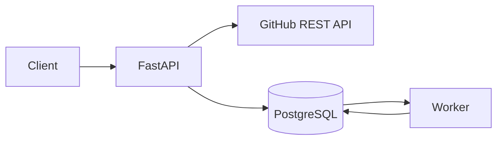

# github-data-sync-service

[](https://github.com/lukaszj321/github-data-sync-service/actions/workflows/ci.yml)

Aktualna wersja: `0.1.0`

Release: <https://github.com/lukaszj321/github-data-sync-service/releases/tag/v0.1.0>

`github-data-sync-service` to fundament backendu do bezpiecznego rejestrowania publicznych repozytoriów GitHuba i późniejszej synchronizacji danych operacyjnych. Milestone 1 kończy się na walidacji repozytorium przez GitHub REST API oraz idempotentnym zapisie metadanych w PostgreSQL.

To nie jest zwykły CRUD: aplikacja musi rozdzielać zewnętrzne I/O od transakcji bazy danych, obsługiwać rename albo transfer repozytorium przez stabilne `github_id`, respektować rate limiting GitHuba i przygotować kolejkę PostgreSQL dla kolejnych etapów.

## Wydania

Informacje o zmianach znajdują się w [CHANGELOG.md](CHANGELOG.md).

## Zakres Milestone 1

Gotowe są: FastAPI, synchroniczne SQLAlchemy 2, PostgreSQL, Alembic, klient `GET /repos/{owner}/{repo}`, endpointy repozytoriów, tabela `sync_jobs`, worker jako osobny proces, Docker Compose, testy i CI. Nie ma jeszcze synchronizacji issues, paginacji, ETag ani endpointu tworzenia zadań synchronizacji.



## Architektura

API i worker używają tego samego obrazu aplikacji. Endpoint `POST /repositories` najpierw odpytuje GitHuba, a dopiero potem otwiera krótką transakcję zapisu. Idempotencja opiera się na `UNIQUE (github_id)` i PostgreSQL `ON CONFLICT DO UPDATE`, a nie na samym wcześniejszym `SELECT`.

Worker ma fundament kolejki: cyklicznie pobiera pojedyncze dostępne zadanie przez `FOR UPDATE SKIP LOCKED`, natychmiast zwalnia blokadę po commicie i w tym etapie oznacza nieobsługiwane typy jako `failed`.

## Struktura

```text
src/github_data_sync_service/
  api/
  core/
  db/
  github/
  queue/
  repositories/
  worker/
alembic/
tests/
```

## Konfiguracja

Konfiguracja pochodzi z `pydantic-settings` i zmiennych środowiskowych:

```text
APP_ENV
LOG_LEVEL
DATABASE_URL
GITHUB_TOKEN
GITHUB_API_BASE_URL
GITHUB_API_VERSION
GITHUB_USER_AGENT
GITHUB_CONNECT_TIMEOUT_SECONDS
GITHUB_READ_TIMEOUT_SECONDS
GITHUB_MAX_ATTEMPTS
WORKER_POLL_INTERVAL_SECONDS
WORKER_ID
```

`GITHUB_TOKEN` jest opcjonalny i może pochodzić wyłącznie ze środowiska. `.env.example` zawiera pustą wartość `GITHUB_TOKEN=`, a logi i wyjątki redagują sekrety oraz connection stringi z hasłem.

## Uruchomienie

Lokalne hasło w `compose.yaml` jest wyłącznie demonstracyjne.

```powershell
docker compose up --build -d
curl http://localhost:8000/health
curl http://localhost:8000/ready
```

Migracje:

```powershell
alembic upgrade head
alembic downgrade base
alembic upgrade head
```

Rejestracja repozytorium:

```powershell
curl -X POST http://localhost:8000/repositories `
  -H "Content-Type: application/json" `
  -d "{\"owner\":\"fastapi\",\"name\":\"fastapi\"}"
```

Przykładowa odpowiedź:

```json
{
  "id": "00000000-0000-0000-0000-000000000000",
  "github_id": 160919119,
  "owner": "fastapi",
  "name": "fastapi",
  "full_name": "fastapi/fastapi",
  "html_url": "https://github.com/fastapi/fastapi",
  "description": "...",
  "default_branch": "master",
  "is_fork": false,
  "is_archived": false,
  "github_created_at": "2018-12-08T15:00:42Z",
  "github_updated_at": "2026-01-01T00:00:00Z",
  "last_validated_at": "2026-01-01T00:00:00Z",
  "created_at": "2026-01-01T00:00:00Z",
  "updated_at": "2026-01-01T00:00:00Z"
}
```

## API i błędy

Endpointy:

```text
POST /repositories
GET /repositories?limit=50&offset=0
GET /repositories/{repository_id}
GET /health
GET /ready
```

Błędy mają stabilny format:

```json
{
  "error": {
    "code": "github_repository_not_found",
    "message": "The requested public GitHub repository was not found.",
    "request_id": "..."
  }
}
```

Rate limit GitHuba zwraca `429`, timeout `504`, tymczasowy błąd upstream `503`, błędny JSON albo struktura `502`, lokalny brak repozytorium `404`, a niedostępny PostgreSQL w `/ready` `503`.

## Testy i quality gates

```powershell
python -m ruff check .
python -m ruff format --check .
python -m mypy src
python -m pytest -m "not integration and not live" -W error `
  --cov=github_data_sync_service `
  --cov-branch `
  --cov-report=term-missing `
  --cov-fail-under=85
```

Integracyjne PostgreSQL:

```powershell
docker compose up -d db
alembic upgrade head
python -m pytest -m integration -W error
```

Test live jest domyślnie pomijany:

```powershell
$env:RUN_LIVE_TESTS="1"
python -m pytest -m live
```

## Kolejne etapy

Milestone 2 obejmie endpoint tworzenia zadania synchronizacji issues, paginację przez `Link`, filtrowanie pull requestów z endpointu issues, idempotentny upsert issues, statystyki zadania i obsługę rate limitu przez `available_at`.
