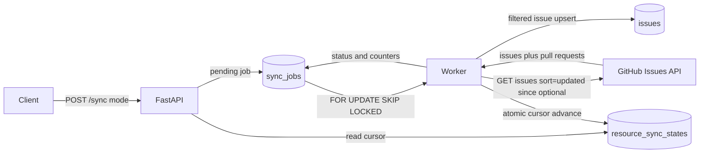

# github-data-sync-service

[](https://github.com/lukaszj321/github-data-sync-service/actions/workflows/ci.yml)

Aktualna wersja: `0.3.0`

Wydania: <https://github.com/lukaszj321/github-data-sync-service/releases>

`github-data-sync-service` to backend do rejestrowania publicznych repozytoriów GitHuba i synchronizacji wybranych danych do PostgreSQL. API tworzy lokalne zadania synchronizacji, a osobny worker pobiera issues stronami z GitHub REST API, filtruje pull requesty, idempotentnie zapisuje issues oraz obsługuje rate limiting, recovery, błędy pojedynczego joba i trwały kursor synchronizacji.

Wersja `0.3.0` dodaje pełny i przyrostowy tryb synchronizacji issues. Pierwszy przebieg nadal wykonuje bootstrap full, a następne przebiegi mogą używać parametru `since` z bezpiecznym oknem nakładania.

## Zacznij tutaj

Projekt rozwiązuje problem bezpiecznego przeniesienia synchronizacji z requestu HTTP do kontrolowanej kolejki PostgreSQL. Klient rejestruje repozytorium i tworzy job, worker wykonuje synchronizację poza requestem API, a aplikacja zapisuje wynik i stan kursora w lokalnej bazie.

Zakres wersji `0.3.0` obejmuje synchronizację issues, paginację po `Link`, filtrowanie pull requestów, idempotentny upsert, liczniki joba, rate-limit rescheduling, stale recovery, izolację błędów pojedynczego joba, tryby `full` i `incremental`, trwały `ResourceSyncState` oraz endpoint odczytu stanu synchronizacji.

Kolejność czytania:

1. Status projektu i zakres wersji `0.3.0`.
2. Architektura oraz przepływ synchronizacji.
3. Tryby synchronizacji i trwały kursor.
4. Uruchomienie przez Docker Compose.
5. Rejestracja repozytorium.
6. Utworzenie zadania synchronizacji.
7. Sprawdzanie statusu joba i stanu synchronizacji.
8. Odczyt zsynchronizowanych issues.
9. Testy, ograniczenia i informacje o wydaniach.

---

## Spis treści

- [Zacznij tutaj](#zacznij-tutaj)
- [Status projektu](#status-projektu)
  - [Gotowe w wersji 0.3.0](#gotowe-w-wersji-030)
  - [Świadome ograniczenia](#świadome-ograniczenia)
  - [Poza zakresem wersji 0.3.0](#poza-zakresem-wersji-030)
- [Architektura](#architektura)
  - [Komponenty](#komponenty)
  - [Przepływ synchronizacji](#przepływ-synchronizacji)
  - [Granice transakcji](#granice-transakcji)
  - [Obsługa awarii](#obsługa-awarii)
- [Tryby synchronizacji](#tryby-synchronizacji)
  - [Bootstrap full](#bootstrap-full)
  - [Incremental](#incremental)
  - [Explicit full](#explicit-full)
- [Trwały kursor](#trwały-kursor)
  - [Okno nakładania](#okno-nakładania)
  - [Stan synchronizacji](#stan-synchronizacji)
  - [Bezpieczne przesuwanie kursora](#bezpieczne-przesuwanie-kursora)
- [Zakres wersji 0.3.0](#zakres-wersji-030)
- [Struktura projektu](#struktura-projektu)
- [API](#api)
  - [Rejestracja repozytorium](#rejestracja-repozytorium)
  - [Listowanie i odczyt repozytoriów](#listowanie-i-odczyt-repozytoriów)
  - [Tworzenie zadania synchronizacji](#tworzenie-zadania-synchronizacji)
  - [Sprawdzanie statusu zadania](#sprawdzanie-statusu-zadania)
  - [Odczyt stanu synchronizacji](#odczyt-stanu-synchronizacji)
  - [Odczyt issues](#odczyt-issues)
  - [Health i readiness](#health-i-readiness)
- [Konfiguracja](#konfiguracja)
- [Uruchomienie](#uruchomienie)
  - [Docker Compose](#docker-compose)
  - [Migracje](#migracje)
- [Przykład end-to-end](#przykład-end-to-end)
- [Semantyka liczników](#semantyka-liczników)
- [Rate limiting i ponowne próby](#rate-limiting-i-ponowne-próby)
- [Recovery zadań](#recovery-zadań)
- [Najczęstsze zadania](#najczęstsze-zadania)
- [Testy i quality gates](#testy-i-quality-gates)
- [Ograniczenia](#ograniczenia)
- [Wydania](#wydania)
- [Nawigacja](#nawigacja)

## Status projektu

### Gotowe w wersji 0.3.0

- Rejestracja publicznych repozytoriów.
- Walidacja repozytorium przez GitHub REST API.
- PostgreSQL job queue z `FOR UPDATE SKIP LOCKED`.
- Osobny proces workera.
- Synchronizacja issues.
- Tryby `full` i `incremental`.
- Bootstrap full przy pierwszym żądaniu incremental bez kursora.
- Trwały stan `resource_sync_states` dla repozytorium i zasobu.
- Paginacja przez nagłówek `Link` i `rel="next"`.
- Sortowanie issues po `updated` rosnąco.
- Parametr GitHub `since` dla synchronizacji przyrostowej.
- Konfigurowane overlap window.
- Filtrowanie pull requestów zwracanych przez GitHub Issues API.
- Idempotentny upsert issues.
- Statystyki joba.
- Rate-limit rescheduling.
- Stale job recovery.
- Endpoint `GET /repositories/{repository_id}/sync-state`.
- Docker Compose.
- Migracje Alembic.
- Testy jednostkowe, integracyjne PostgreSQL i opcjonalne live.
- GitHub Actions.

### Świadome ograniczenia

- Obsługiwane są wyłącznie publiczne repozytoria.
- Nie ma ETag ani conditional requests.
- Nie ma persistent page-level resume.
- Numer strony i `next_url` nie są trwałymi checkpointami.
- Nie ma wznawiania od środka częściowo przetworzonego joba.
- Nie ma automatycznego usuwania lokalnych issues nieobecnych w późniejszej odpowiedzi GitHuba.
- Nie ma synchronizacji innych zasobów GitHuba.

### Poza zakresem wersji 0.3.0

Te obszary nie są zaimplementowane w `0.3.0`:

- Pull requesty jako osobny zasób.
- Commity, releases, workflow runs, komentarze, labels, milestones i assignees.
- Webhooki i harmonogram cykliczny.
- Endpoint cancellation i ręczny retry.
- GraphQL, OAuth i prywatne repozytoria wymagające nowego modelu autoryzacji.
- Frontend, Redis, Celery, Kafka, Kubernetes i wdrożenie chmurowe.
- LLM.

[↑ Powrót do spisu treści](#spis-treści)

---

## Architektura

### Komponenty

- FastAPI odpowiada za endpointy HTTP, walidację requestów, mapowanie odpowiedzi i cykl życia zależności.
- PostgreSQL przechowuje repozytoria, joby synchronizacji, zsynchronizowane issues i trwały stan zasobu.
- `sync_jobs` jest kolejką pracy opartą o statusy, `available_at`, lock metadata i `FOR UPDATE SKIP LOCKED`.
- `resource_sync_states` przechowuje kursor dla pary `repository_id` oraz `resource_type`.
- Worker przejmuje dostępne joby i wykonuje synchronizację poza requestem HTTP.
- `GitHubClient` obsługuje requesty do GitHub REST API, retry błędów tymczasowych, klasyfikację rate limitów, `since` i bezpieczne diagnostyki.
- Issues store zapisuje issues idempotentnie i rozróżnia rekordy utworzone, zaktualizowane oraz niezmienione.
- Alembic zarządza schematem bazy danych.
- Docker Compose uruchamia PostgreSQL, jednorazowe migracje, API i workera.
- GitHub Actions wykonuje lint, format, mypy, testy, build pakietu i smoke kontenera.

### Przepływ synchronizacji



Kroki przepływu:

1. Klient rejestruje repozytorium albo korzysta z istniejącego `repository_id`.
2. Klient tworzy zadanie przez `POST /repositories/{repository_id}/sync`.
3. API sprawdza `ResourceSyncState`, rozstrzyga faktyczny `sync_mode`, wylicza `cursor_before` i `since_at`, a następnie zapisuje lokalny job `pending`.
4. Jeżeli istnieje aktywny job dla tego repozytorium i zasobu, API zwraca go bez zmiany trybu.
5. Worker claimuje dostępny job przez krótką transakcję z `FOR UPDATE SKIP LOCKED`.
6. Worker ustawia `sync_window_started_at` tylko przy pierwszym claimie joba.
7. Worker pobiera strony z GitHub Issues API, używając `since` tylko dla faktycznego trybu incremental.
8. Rekordy z polem `pull_request` są liczone jako pominięte i nie trafiają do tabeli `issues`.
9. Issues są zapisywane idempotentnie, a statystyki joba są aktualizowane.
10. Po pełnym sukcesie job i `ResourceSyncState` są aktualizowane w jednej transakcji.

### Granice transakcji

Endpoint tworzący job nie wykonuje requestu do GitHuba. Odczyt stanu i utworzenie joba są kontrolowane przez przepływ transakcyjny, a ochronę przed duplikatem aktywnego joba zapewnia partial unique index.

Claim joba jest krótką transakcją, która kończy się przed komunikacją HTTP, więc worker nie trzyma blokady bazy podczas requestów do GitHuba.

Każda poprawnie sparsowana strona jest zapisywana w osobnej krótkiej transakcji. Upsert issues i aktualizacja liczników danej strony są atomowe: jeżeli commit strony się nie powiedzie, zapisy issues z tej strony są wycofywane razem z licznikami. Błąd późniejszej strony nie usuwa wcześniejszych zatwierdzonych stron.

Completion jest osobną transakcją: job może zostać oznaczony jako `completed` tylko razem z poprawnym przesunięciem trwałego stanu zasobu.

### Obsługa awarii

Kontrolowane błędy GitHuba są klasyfikowane przez klienta. Błędy tymczasowe mogą zostać ponowione zgodnie z konfiguracją. Rate limit kończy iterację statusem `rate_limited`, czyści lock metadata, zachowuje `sync_mode`, `cursor_before`, `since_at` oraz `sync_window_started_at`, ustawia `available_at` i nie przesuwa kursora.

Nieoczekiwany błąd aplikacji albo bazy w trakcie pojedynczego joba jest izolowany. Worker wykonuje rollback sesji, próbuje oznaczyć job jako `failed`, zapisuje bezpieczne `last_error`, czyści lock metadata i przechodzi do kolejnej iteracji. Stale recovery jest zabezpieczeniem awaryjnym dla przerwanych procesów albo niedostępnej bazy, a nie podstawową ścieżką obsługi wyjątków pojedynczego joba.

Źródła implementacji:

- API i routing: [`src/github_data_sync_service/api/`](src/github_data_sync_service/api/)
- Klient GitHuba i paginacja: [`src/github_data_sync_service/github/`](src/github_data_sync_service/github/)
- Kolejka i joby: [`src/github_data_sync_service/queue/`](src/github_data_sync_service/queue/)
- Worker: [`src/github_data_sync_service/worker/`](src/github_data_sync_service/worker/)
- Upsert i odczyt issues: [`src/github_data_sync_service/issues/`](src/github_data_sync_service/issues/)
- Modele bazy danych: [`src/github_data_sync_service/db/models/`](src/github_data_sync_service/db/models/)
- Migracje: [`alembic/versions/`](alembic/versions/)

[↑ Powrót do spisu treści](#spis-treści)

---

## Tryby synchronizacji

### Bootstrap full

Domyślny request używa `mode = incremental`, ale jeżeli dla repozytorium nie istnieje jeszcze udany `ResourceSyncState.cursor_at`, API tworzy faktyczny job `sync_mode = full`.

W takim jobie:

- `cursor_before = null`
- `since_at = null`
- GitHub request nie zawiera `since`
- response pokazuje faktyczny `sync_mode = full`

To zachowanie pozwala klientowi zawsze wysyłać ten sam domyślny request i bezpiecznie przejść od pustej bazy do późniejszych synchronizacji przyrostowych.

### Incremental

Gdy istnieje `cursor_at`, request `mode = incremental` tworzy job z:

- `sync_mode = incremental`
- `cursor_before = state.cursor_at`
- `since_at = cursor_before - ISSUES_SYNC_OVERLAP_SECONDS`

Worker wysyła do GitHuba:

```text
state=all
per_page=100
sort=updated
direction=asc
since=2026-07-17T11:59:00Z
```

Następne strony są pobierane wyłącznie przez zwalidowany `Link rel="next"`. Aplikacja nie dokleja ponownie `since` do `next_url`, nie zapisuje `next_url` jako kursora i nie traktuje numeru strony jako checkpointu.

### Explicit full

Request z `mode = full` wymusza pełną synchronizację:

```json
{
  "resource_type": "issues",
  "mode": "full"
}
```

Jeżeli istnieje poprzedni kursor, `cursor_before` może go zawierać diagnostycznie, ale `since_at` musi pozostać `null`, a request do GitHuba nie zawiera `since`. Po pełnym sukcesie stan kursora przesuwa się do nowego `sync_window_started_at`.

[↑ Powrót do spisu treści](#spis-treści)

---

## Trwały kursor

Kursor nie jest numerem strony, `next_url`, ETagiem ani maksymalnym `github_updated_at` znalezionym w odpowiedzi. Bezpiecznym kandydatem na nowy kursor jest czas rozpoczęcia okna synchronizacji, czyli `sync_window_started_at`, zapisany przed pierwszym requestem HTTP danego joba.

Znaczenie nowych pól joba:

- `sync_mode`: faktyczny tryb wykonania joba, `full` albo `incremental`.
- `cursor_before`: `cursor_at` odczytany ze stanu synchronizacji podczas tworzenia joba.
- `since_at`: `cursor_before` cofnięty o overlap; `null` dla full.
- `sync_window_started_at`: czas rozpoczęcia okna synchronizacji, ustawiany tylko raz przy pierwszym claimie joba.
- `cursor_after`: ustawiany wyłącznie po pełnym sukcesie, równy `sync_window_started_at`.

### Okno nakładania

`ISSUES_SYNC_OVERLAP_SECONDS` domyślnie wynosi `60`. Dla kursora:

```text
cursor_at = 2026-07-17T12:00:00Z
overlap = 60 sekund
since_at = 2026-07-17T11:59:00Z
```

Duplikaty z overlap window są oczekiwane. Idempotentny upsert rozpozna je jako `created`, `updated` albo `unchanged`. Jeżeli overlap wynosi `0`, `since_at` jest równe `cursor_before`.

Timestamp wysyłany jako `since` jest timezone-aware, normalizowany do UTC, obcinany do sekund i serializowany z końcowym `Z`, na przykład `2026-07-17T11:59:00Z`. Naiwny `datetime` bez strefy jest odrzucany w kontrolowanej funkcji klienta.

### Stan synchronizacji

`resource_sync_states` przechowuje stan dla pary repozytorium i zasób:

- `id`
- `repository_id`
- `resource_type`
- `cursor_at`
- `last_successful_job_id`
- `last_sync_mode`
- `last_started_at`
- `last_completed_at`
- `created_at`
- `updated_at`

Stan nie powstaje przy samym utworzeniu joba. `initialized = true` dopiero po udanym completion.

### Bezpieczne przesuwanie kursora

Kursor przesuwa się tylko po pełnym, poprawnym zakończeniu wszystkich stron danego joba. Completion w jednej transakcji blokuje job, tworzy albo aktualizuje `ResourceSyncState`, ustawia `cursor_at`, `last_successful_job_id`, `last_sync_mode`, `last_started_at`, `last_completed_at`, `job.cursor_after`, `status = completed`, `finished_at` i czyści lock metadata.

Kursor nie przesuwa się po:

- `failed`
- `rate_limited`
- `cancelled`
- przerwaniu procesu
- stale recovery
- błędzie zapisu późniejszej strony
- błędzie transakcji completion

Jeżeli starszy odzyskany job zakończy się po nowszym udanym jobie, nie może cofnąć `state.cursor_at`. Job zachowuje własne `cursor_after` diagnostycznie, ale trwały high-watermark pozostaje nowszy.

ETag nie jest jeszcze użyty do pomijania całej paginowanej kolekcji, ponieważ obecny przepływ nie wysyła conditional headers. Nieoczekiwane `304` w tym trybie jest traktowane jako błąd odpowiedzi, nie jako sukces synchronizacji.

[↑ Powrót do spisu treści](#spis-treści)

---

## Zakres wersji 0.3.0

Wersja `0.1.0` dostarczyła rejestrację repozytoriów, fundament kolejki PostgreSQL, migracje, podstawową strukturę API i walidacje jakości.

Wersja `0.2.0` dodała wykonanie jobów `issues` przez workera, lokalną tabelę `issues`, endpointy jobów i issues, paginację po `rel="next"`, filtrowanie pull requestów, liczniki synchronizacji, rate-limit rescheduling, stale recovery oraz izolację błędów pojedynczego joba.

Wersja `0.3.0` dodaje trwały stan synchronizacji zasobu, tryby `full` i `incremental`, parametr GitHub `since`, overlap window, atomowe przesuwanie kursora i endpoint `sync-state`.

To podsumowanie nie zastępuje pełnej historii zmian. Szczegóły są w [CHANGELOG.md](CHANGELOG.md). Opisy stabilnych wydań pozostają dostępne w [RELEASE_NOTES_v0.2.0.md](RELEASE_NOTES_v0.2.0.md) i [RELEASE_NOTES_v0.1.0.md](RELEASE_NOTES_v0.1.0.md).

[↑ Powrót do spisu treści](#spis-treści)

---

## Struktura projektu

```text
src/github_data_sync_service/
  api/
    routes/
    schemas/
  core/
  db/
    models/
  github/
  issues/
  queue/
  repositories/
  worker/
alembic/
  versions/
tests/
  unit/
  integration/
  live/
```

Najważniejsze obszary:

- `api/` zawiera aplikację FastAPI, routing, schematy odpowiedzi i zależności.
- `core/` zawiera konfigurację, logowanie i błędy aplikacyjne.
- `db/` zawiera sesje SQLAlchemy i modele tabel, w tym `ResourceSyncState`.
- `github/` zawiera klienta GitHuba, modele odpowiedzi i obsługę paginacji.
- `issues/` zawiera idempotentny zapis i odczyt issues.
- `queue/` zawiera operacje na `sync_jobs` oraz serwis tworzenia jobów.
- `repositories/` zawiera rejestrację i odczyt repozytoriów.
- `worker/` zawiera proces workera i processor synchronizacji.
- `alembic/versions/` zawiera migracje schematu.
- `tests/` zawiera testy jednostkowe, integracyjne PostgreSQL i opcjonalne testy live.

[↑ Powrót do spisu treści](#spis-treści)

---

## API

Aktualne endpointy:

```text
POST /repositories
GET /repositories
GET /repositories/{repository_id}
POST /repositories/{repository_id}/sync
GET /repositories/{repository_id}/sync-state
GET /sync-jobs
GET /sync-jobs/{job_id}
GET /repositories/{repository_id}/issues
GET /health
GET /ready
```

### Rejestracja repozytorium

`POST /repositories` waliduje publiczne repozytorium przez GitHub REST API i zapisuje je lokalnie.

Request:

```json
{
  "owner": "lukaszj321",
  "name": "github-data-sync-service"
}
```

Status `201 Created` oznacza nową lokalną rejestrację. Status `200 OK` oznacza, że repozytorium było już zapisane lokalnie i zostało odświeżone.

### Listowanie i odczyt repozytoriów

`GET /repositories` zwraca listę lokalnie zapisanych repozytoriów. Parametry `limit` i `offset` są ograniczane do bezpiecznych wartości; `limit` mieści się w zakresie `1..100`.

`GET /repositories/{repository_id}` zwraca pojedyncze repozytorium z PostgreSQL.

### Tworzenie zadania synchronizacji

`POST /repositories/{repository_id}/sync` tworzy job synchronizacji issues.

Domyślny incremental request:

```json
{
  "resource_type": "issues",
  "mode": "incremental"
}
```

Wymuszony full request:

```json
{
  "resource_type": "issues",
  "mode": "full"
}
```

Nowy job zwraca `202 Accepted`. Jeżeli istnieje aktywny job `pending`, `running` albo `rate_limited` dla tego repozytorium i zasobu, API zwraca go z `200 OK`, nie zmienia jego trybu i zachowuje nagłówek `Location`.

Endpoint nie wykonuje requestu do GitHuba. Zapisuje wyłącznie lokalny job dla workera.

### Sprawdzanie statusu zadania

`GET /sync-jobs` listuje joby. Obsługiwane są parametry `limit`, `offset`, `repository_id`, `status`, `resource_type` i `mode`.

`GET /sync-jobs/{job_id}` zwraca pojedynczy job.

Przykładowe pola odpowiedzi:

```json
{
  "id": "00000000-0000-0000-0000-000000000000",
  "repository_id": "00000000-0000-0000-0000-000000000000",
  "resource_type": "issues",
  "sync_mode": "incremental",
  "cursor_before": "2026-07-17T12:00:00Z",
  "since_at": "2026-07-17T11:59:00Z",
  "cursor_after": "2026-07-17T12:10:00Z",
  "sync_window_started_at": "2026-07-17T12:10:00Z",
  "status": "completed",
  "attempt_count": 1,
  "available_at": "2026-07-17T12:09:59Z",
  "locked_at": null,
  "locked_by": null,
  "heartbeat_at": null,
  "started_at": "2026-07-17T12:10:00Z",
  "finished_at": "2026-07-17T12:10:03Z",
  "current_page": 1,
  "fetched_count": 0,
  "skipped_count": 0,
  "created_count": 0,
  "updated_count": 0,
  "unchanged_count": 0,
  "error_count": 0,
  "last_error": null,
  "github_request_id": "request-id",
  "rate_limit_remaining": 50,
  "created_at": "2026-07-17T12:09:59Z",
  "updated_at": "2026-07-17T12:10:03Z"
}
```

### Odczyt stanu synchronizacji

`GET /repositories/{repository_id}/sync-state` zwraca stan synchronizacji issues bez requestu do GitHuba.

Przed pierwszym sukcesem:

```json
{
  "repository_id": "00000000-0000-0000-0000-000000000000",
  "resource_type": "issues",
  "initialized": false,
  "cursor_at": null,
  "last_successful_job_id": null,
  "last_sync_mode": null,
  "last_started_at": null,
  "last_completed_at": null
}
```

Po sukcesie:

```json
{
  "repository_id": "00000000-0000-0000-0000-000000000000",
  "resource_type": "issues",
  "initialized": true,
  "cursor_at": "2026-07-17T12:10:00Z",
  "last_successful_job_id": "00000000-0000-0000-0000-000000000000",
  "last_sync_mode": "incremental",
  "last_started_at": "2026-07-17T12:10:00Z",
  "last_completed_at": "2026-07-17T12:10:03Z"
}
```

Nieistniejące repozytorium zwraca `404`.

### Odczyt issues

`GET /repositories/{repository_id}/issues` czyta lokalne issues z PostgreSQL i nie odpytuje GitHuba.

Parametry:

- `limit`, domyślnie `50`, ograniczane do `1..100`.
- `offset`, domyślnie `0`, wartości ujemne są sprowadzane do `0`.
- `state`, opcjonalny filtr stanu issue.

Wynik jest sortowany po `number DESC`. Brak lokalnych issues zwraca `200 OK` z pustą listą.

### Health i readiness

`GET /health` zwraca prosty status procesu API.

`GET /ready` sprawdza połączenie z PostgreSQL przez `SELECT 1`.

[↑ Powrót do spisu treści](#spis-treści)

---

## Konfiguracja

Konfiguracja pochodzi z `pydantic-settings`, zmiennych środowiskowych i opcjonalnego pliku `.env`.

| Zmienna | Domyślnie | Przeznaczenie |
| --- | --- | --- |
| `APP_ENV` | `local` | Nazwa środowiska aplikacji. |
| `LOG_LEVEL` | `INFO` | Poziom logowania. |
| `DATABASE_URL` | lokalny PostgreSQL `github_data_sync` | Adres bazy danych SQLAlchemy. |
| `GITHUB_TOKEN` | brak | Opcjonalny token zwiększający limity GitHub API; pochodzi wyłącznie ze środowiska. |
| `GITHUB_API_BASE_URL` | `https://api.github.com` | Bazowy URL GitHub REST API. |
| `GITHUB_API_VERSION` | `2022-11-28` | Wersja API wysyłana w nagłówkach requestu. |
| `GITHUB_USER_AGENT` | `github-data-sync-service/0.3.0` | User-Agent klienta; domyślnie wykorzystuje aktualną wersję pakietu. |
| `GITHUB_CONNECT_TIMEOUT_SECONDS` | `5` | Timeout zestawiania połączenia. |
| `GITHUB_READ_TIMEOUT_SECONDS` | `15` | Timeout odczytu odpowiedzi. |
| `GITHUB_MAX_ATTEMPTS` | `3` | Maksymalna liczba prób dla błędów tymczasowych; minimum `1`. |
| `GITHUB_ISSUES_PER_PAGE` | `100` | Liczba elementów na stronie issues; zakres `1..100`. |
| `GITHUB_MAX_PAGES_PER_SYNC` | `1000` | Bezpiecznik przed nieskończoną paginacją; minimum `1`. |
| `ISSUES_SYNC_OVERLAP_SECONDS` | `60` | Cofnięcie `since_at` względem `cursor_before`; zakres `0..86400`. |
| `WORKER_POLL_INTERVAL_SECONDS` | `5` | Odstęp workera, gdy nie ma dostępnego joba albo potrzebny jest backoff. |
| `WORKER_RATE_LIMIT_FALLBACK_SECONDS` | `60` | Fallback rate limitu, gdy odpowiedź nie ma jednoznacznych nagłówków. |
| `WORKER_STALE_JOB_TIMEOUT_SECONDS` | `300` | Czas po którym porzucony `running` job może zostać odzyskany. |
| `WORKER_ID` | `worker-local` | Identyfikator workera zapisywany w lock metadata. |

`GITHUB_USER_AGENT` pozwala na jawny override, ale nie trzeba go ustawiać w typowym uruchomieniu. `GITHUB_MAX_PAGES_PER_SYNC` chroni przed pętlą paginacji. Fallback rate limitu jest używany tylko wtedy, gdy nie można wyznaczyć czasu wznowienia z odpowiedzi GitHuba. Stale timeout określa moment odzyskania porzuconego `running` joba.

Nie umieszczaj sekretów w repozytorium ani w przykładach komend. Token GitHuba powinien pochodzić ze środowiska uruchomieniowego.

[↑ Powrót do spisu treści](#spis-treści)

---

## Uruchomienie

### Docker Compose

Start:

```powershell
docker compose up --build -d
docker compose ps
```

Sprawdzenie:

```powershell
curl http://localhost:8000/health
curl http://localhost:8000/ready
```

Zatrzymanie:

```powershell
docker compose down --volumes --remove-orphans
```

Role usług:

- `db` uruchamia PostgreSQL.
- `migrate` wykonuje jednorazowo `alembic upgrade head`.
- `api` uruchamia FastAPI przez Uvicorn.
- `worker` uruchamia `github-data-sync-worker` i wykonuje joby synchronizacji.

### Migracje

```powershell
alembic upgrade head
alembic downgrade -1
alembic upgrade head
```

W Compose migracje wykonuje osobna usługa `migrate`, od której zależą `api` i `worker`.

[↑ Powrót do spisu treści](#spis-treści)

---

## Przykład end-to-end

Poniższy przykład uruchamia stack, rejestruje publiczne repozytorium, tworzy bootstrap full, potem incremental i wymuszony full.

```powershell
docker compose down --volumes --remove-orphans
docker compose up --build -d

Invoke-RestMethod -Uri "http://localhost:8000/health"
Invoke-RestMethod -Uri "http://localhost:8000/ready"

$repo = Invoke-RestMethod -Method Post `
  -Uri "http://localhost:8000/repositories" `
  -ContentType "application/json" `
  -Body '{"owner":"lukaszj321","name":"github-data-sync-service"}'

$repositoryId = $repo.id

$firstJob = Invoke-RestMethod -Method Post `
  -Uri "http://localhost:8000/repositories/$repositoryId/sync" `
  -ContentType "application/json" `
  -Body '{"resource_type":"issues","mode":"incremental"}'

for ($i = 0; $i -lt 60; $i++) {
  $firstCurrent = Invoke-RestMethod -Uri "http://localhost:8000/sync-jobs/$($firstJob.id)"
  if ($firstCurrent.status -in @("completed", "failed", "rate_limited")) { break }
  Start-Sleep -Seconds 2
}

$stateAfterBootstrap = Invoke-RestMethod -Uri "http://localhost:8000/repositories/$repositoryId/sync-state"

$secondJob = Invoke-RestMethod -Method Post `
  -Uri "http://localhost:8000/repositories/$repositoryId/sync" `
  -ContentType "application/json" `
  -Body '{"resource_type":"issues","mode":"incremental"}'

for ($i = 0; $i -lt 60; $i++) {
  $secondCurrent = Invoke-RestMethod -Uri "http://localhost:8000/sync-jobs/$($secondJob.id)"
  if ($secondCurrent.status -in @("completed", "failed", "rate_limited")) { break }
  Start-Sleep -Seconds 2
}

$fullJob = Invoke-RestMethod -Method Post `
  -Uri "http://localhost:8000/repositories/$repositoryId/sync" `
  -ContentType "application/json" `
  -Body '{"resource_type":"issues","mode":"full"}'

$issues = Invoke-RestMethod -Uri "http://localhost:8000/repositories/$repositoryId/issues?limit=100"
$syncState = Invoke-RestMethod -Uri "http://localhost:8000/repositories/$repositoryId/sync-state"

$firstCurrent.sync_mode
$secondCurrent.sync_mode
$secondCurrent.cursor_before
$secondCurrent.since_at
$syncState.initialized
$issues.items.Count

docker compose down --volumes --remove-orphans
```

Repozytorium może mieć zero zwykłych issues. Pusty wynik jest poprawny, jeżeli worker odebrał job, job zakończył się kontrolowanym statusem, a cursor state został zaktualizowany po sukcesie.

[↑ Powrót do spisu treści](#spis-treści)

---

## Semantyka liczników

- `fetched_count`: wszystkie elementy zwrócone przez GitHub Issues API, włącznie z pull requestami.
- `skipped_count`: elementy pominięte, bo zawierały pole `pull_request`.
- `created_count`: nowe lokalne issues.
- `updated_count`: istniejące issues, których pola domenowe realnie się zmieniły.
- `unchanged_count`: istniejące issues identyczne z aktualną odpowiedzią GitHuba, w tym rekordy ponownie pobrane przez overlap.
- `error_count`: przerwane próby, błędy joba i odzyskane stale locki; licznik jest kumulatywny.

Dla poprawnie zakończonej synchronizacji bez duplikatów po stronie GitHuba:

```text
created_count + updated_count + unchanged_count = fetched_count - skipped_count
```

[↑ Powrót do spisu treści](#spis-treści)

---

## Rate limiting i ponowne próby

Pierwszy request issues używa:

```text
state=all
per_page=100
sort=updated
direction=asc
```

Dla incremental dodawany jest `since`. Kolejne strony są pobierane wyłącznie z `rel="next"` w nagłówku `Link`. Worker nie konstruuje ręcznie numerów stron. `next_url` musi używać `https`, wskazywać ten sam host i port co `GITHUB_API_BASE_URL` oraz nie może zawierać danych uwierzytelniających. Powtórzony `next_url`, pętla paginacji albo przekroczenie `GITHUB_MAX_PAGES_PER_SYNC` kończą job statusem `failed`.

Dla rate-limited `403` oraz `429` worker nie śpi długo. Job przechodzi w `rate_limited`, czyści lock metadata, zapisuje bezpieczny `last_error`, request ID, remaining i `available_at`:

1. `now + Retry-After`, jeżeli nagłówek istnieje.
2. `X-RateLimit-Reset`, jeżeli remaining wynosi `0`.
3. `now + WORKER_RATE_LIMIT_FALLBACK_SECONDS`, domyślnie 60 sekund.

Po `available_at` ten sam job może zostać ponownie pobrany i zaczyna od pierwszej strony. Zachowuje `sync_mode`, `cursor_before`, `since_at` i `sync_window_started_at`; aktualizuje `started_at` dla nowej próby; zwiększa `attempt_count` oraz `error_count`.

[↑ Powrót do spisu treści](#spis-treści)

---

## Recovery zadań

Worker odzyskuje stare joby `running`, których `heartbeat_at` jest starszy niż `WORKER_STALE_JOB_TIMEOUT_SECONDS`. Recovery ustawia `pending`, `available_at = now`, czyści lock metadata i zwiększa `error_count`.

Recovery nie przesuwa `ResourceSyncState.cursor_at`, nie czyści `sync_window_started_at`, nie zmienia `sync_mode`, `cursor_before` ani `since_at`. Retry zaczyna od pierwszej strony i używa pierwotnego zakresu synchronizacji.

[↑ Powrót do spisu treści](#spis-treści)

---

## Najczęstsze zadania

| Zadanie | Gdzie zacząć |
| --- | --- |
| Uruchomić cały stack lokalnie | [Docker Compose](#docker-compose) |
| Sprawdzić, czy API działa | [Health i readiness](#health-i-readiness) |
| Zarejestrować publiczne repozytorium | [Rejestracja repozytorium](#rejestracja-repozytorium) |
| Utworzyć synchronizację issues | [Tworzenie zadania synchronizacji](#tworzenie-zadania-synchronizacji) |
| Zrozumieć full i incremental | [Tryby synchronizacji](#tryby-synchronizacji) |
| Sprawdzić status joba | [Sprawdzanie statusu zadania](#sprawdzanie-statusu-zadania) |
| Sprawdzić durable cursor | [Odczyt stanu synchronizacji](#odczyt-stanu-synchronizacji) |
| Odczytać lokalne issues | [Odczyt issues](#odczyt-issues) |
| Zrozumieć liczniki joba | [Semantyka liczników](#semantyka-liczników) |
| Sprawdzić zachowanie przy rate limit | [Rate limiting i ponowne próby](#rate-limiting-i-ponowne-próby) |
| Zrozumieć odzyskiwanie porzuconych jobów | [Recovery zadań](#recovery-zadań) |
| Uruchomić komplet walidacji | [Testy i quality gates](#testy-i-quality-gates) |
| Sprawdzić historię zmian | [Wydania](#wydania) |

[↑ Powrót do spisu treści](#spis-treści)

---

## Testy i quality gates

Podstawowe walidacje:

```powershell
$env:UV_CACHE_DIR=".uv-cache"
$env:UV_PYTHON_INSTALL_DIR=".uv-python"

uv run --extra dev python -m ruff check .
uv run --extra dev python -m ruff format --check .
uv run --extra dev python -m mypy src
uv run --extra dev python -m pytest -m "not integration and not live" -W error `
  --cov=github_data_sync_service `
  --cov-branch `
  --cov-report=term-missing `
  --cov-fail-under=85
```

Integracyjne PostgreSQL:

```powershell
docker compose up -d db
uv run --extra dev alembic upgrade head
uv run --extra dev python -m pytest -m integration -W error
docker compose down --volumes --remove-orphans
```

Opcjonalne testy live:

```powershell
$env:RUN_LIVE_TESTS="1"
uv run --extra dev python -m pytest -m live -W error
Remove-Item Env:RUN_LIVE_TESTS
```

GitHub Actions wykonuje te same główne bramki jakości, build pakietu, instalację wheel, sprawdzenie wersji workera i Docker non-root smoke.

[↑ Powrót do spisu treści](#spis-treści)

---

## Ograniczenia

- Projekt działa z publicznymi repozytoriami GitHuba.
- Issues są synchronizowane jako zasób z GitHub Issues API; pull requesty są filtrowane, ale nie są synchronizowane jako osobny zasób.
- Nie ma ETag ani conditional request support.
- Incremental sync nie gwarantuje trwałego snapshotu całej paginowanej kolekcji.
- Numer strony i `next_url` nie są checkpointami.
- Lokalny prune issues nie jest wykonywany, bo częściowa synchronizacja nie jest bezpiecznym kompletnym snapshotem.
- Nie ma synchronizacji commits, releases, workflow runs, komentarzy, labels ani milestones.
- Nie ma OAuth, frontendu, Redis, Celery, Kafka, Kubernetes ani wdrożenia chmurowego.
- Projekt nie jest kompletną platformą analityczną GitHuba.

[↑ Powrót do spisu treści](#spis-treści)

---

## Wydania

- Wszystkie wydania: <https://github.com/lukaszj321/github-data-sync-service/releases>
- Changelog: [CHANGELOG.md](CHANGELOG.md)
- Release notes `v0.2.0`: [RELEASE_NOTES_v0.2.0.md](RELEASE_NOTES_v0.2.0.md)
- Release notes `v0.1.0`: [RELEASE_NOTES_v0.1.0.md](RELEASE_NOTES_v0.1.0.md)

Historia:

- `v0.1.0`: fundament rejestracji repozytoriów, kolejki, migracji, Docker Compose i CI.
- `v0.2.0`: wykonanie synchronizacji issues przez workera, lokalne issues, API jobów, obsługa rate limitów, recovery i izolacja błędów joba.
- `0.3.0`: incremental issue synchronization with durable cursors. Nie utworzono jeszcze taga ani release notes dla `v0.3.0`.

[↑ Powrót do spisu treści](#spis-treści)

---

## Nawigacja

- Kod aplikacji: [`src/github_data_sync_service/`](src/github_data_sync_service/)
- Endpointy API: [`src/github_data_sync_service/api/routes/`](src/github_data_sync_service/api/routes/)
- Schematy API: [`src/github_data_sync_service/api/schemas/`](src/github_data_sync_service/api/schemas/)
- Klient GitHuba: [`src/github_data_sync_service/github/`](src/github_data_sync_service/github/)
- Worker: [`src/github_data_sync_service/worker/`](src/github_data_sync_service/worker/)
- Kolejka jobów: [`src/github_data_sync_service/queue/`](src/github_data_sync_service/queue/)
- Issues store: [`src/github_data_sync_service/issues/`](src/github_data_sync_service/issues/)
- Modele bazy: [`src/github_data_sync_service/db/models/`](src/github_data_sync_service/db/models/)
- Model stanu zasobu: [`src/github_data_sync_service/db/models/resource_sync_state.py`](src/github_data_sync_service/db/models/resource_sync_state.py)
- Migracje: [`alembic/versions/`](alembic/versions/)
- Testy jednostkowe: [`tests/unit/`](tests/unit/)
- Testy integracyjne: [`tests/integration/`](tests/integration/)
- Testy live: [`tests/live/`](tests/live/)
- Docker Compose: [`compose.yaml`](compose.yaml)
- Dockerfile: [`Dockerfile`](Dockerfile)
- CI: [`.github/workflows/ci.yml`](.github/workflows/ci.yml)
- Konfiguracja pakietu: [`pyproject.toml`](pyproject.toml)
- Changelog: [`CHANGELOG.md`](CHANGELOG.md)
- Release notes `v0.2.0`: [`RELEASE_NOTES_v0.2.0.md`](RELEASE_NOTES_v0.2.0.md)
- GitHub Releases: <https://github.com/lukaszj321/github-data-sync-service/releases>
